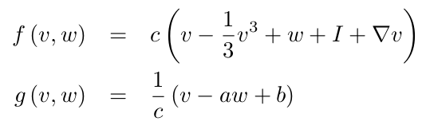
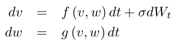

# FitzHugh-Nagumo lattice model in *julia*

This repo contains a simple implementation of the FitzHugh-Nagumo model of cellular excitability on a 2D lattice.

**Requirements:**
1. [julia](https://julialang.org/) installation, latest version tested 1.6.0
2. julia packages (`julia > using Pkg; Pkg.add("Package Name")`)
  - NPZ
  - PyPlot
  - Statistics
  - VideoIO

**Ref.**: FitzHugh, R., Impulses and physiological states in theoretical models of nerve membrane. __*Biophys J*__ 1:445-466, 1961.

## FitzHugh-Nagumo model

The FHN model is a two-variable system for the abstract representation of action potential as those found in neurons or cardiac myocytes. The voltage-like variable $v$ and the recovery variable $w$ implement depolarization current ($I$) induced spiking and a post-spike refractory behaviour.  
Spatial coupling is introduced via diffusion of the voltage-like variable:

Noise is added via Itô-integration:

<!--
$$ 
\frac{dv}{dt} = \frac{1}{c} \left( v - \frac{1}{3}v^3 + w + I_t \right) + D \nabla v \\
\frac{dw}{dt} = c \left( v - a w + b \right) \\
$$
-->

The main function call running the simulation is: `fhn2d(N, T, t0, a, b, c, I, s, D, dt, stim, blocks)`:  
- `N`: lattice size `(N,N)`
- `T`: number of simulation time steps
- `t0`: number of 'warm-up' iterations
- `a,b,c,I`: FHN model parameters, `I`: stimulation current amplitude
- `s`: noise intensity (&sigma;)
- `D`: diffusion constant
- `dt`: integration time step
- `stim`: stimulation current parameters, array of time-, x-, and y-interval borders
- `blocks`: conduction blocks, array of x- and y-interval borders

**Outputs:** `(T,N,N)` array as NumPy .npy format and as .mp4 movie.

Examples 1, 2 use
- `stim = [ [[25,50], [1,N], [3,8]], [[130,150], [n_2-2,n_2+2], [10,25]] ]`
- `blocks = [ [[2*n_4,3*n_4], [15,20]], [[2*n_4+10,3*n_4+10], [40,45]] ]`
where `n_2` is the (rounded) integer `N/2`, `n_4` is the (rounded) integer `N/4`.

### Example-1
Stimulation near the left border generates a travelling wave which breaks at and merges after the conduction blocks. 
After-depolarization does not change the qualitative behaviour of a travelling wave.
Parameters:  
`N = 128, T = 1000, t0 = 0, a = 0.5, b = 0.7, c = 0.3, I = 0.5, s = 0.02, D = 1.0, dt = 0.1`

<video src="videos/fhn2d_I_0.50_sd_0.02_D_1.00.webm" width="256" height="256" controls preload></video>

### Example-2
Increasing the stimulation current while maintaining all other variables constant generates **functional re-entry** (spiral waves) originating where the 2nd stimulus hits repolarizing tissue.
Parameters:  
`N = 128, T = 1000, t0 = 0, a = 0.5, b = 0.7, c = 0.3, I = 1.0, sd = 0.02, D = 1.0, dt = 0.1`

<video src="videos/fhn2d_I_1.00_sd_0.02_D_1.00.webm" width="256" height="256" controls preload></video>

### Example-3
Without a stimulus current (`stim = []`), a large background noise can generate re-entry patterns.
Parameters on the left:  
`N = 128, T = 1000, t0 = 0, a = 0.5, b = 0.7, c = 0.3, I = 0.5, sd = 0.10, D = 1.0, dt = 0.1`  
On the right, with reduced diffusion constant `D=0.25`, other parameters identical.

<video src="videos/fhn2d_I_0.50_sd_0.10_D_1.00.webm" width="256" height="256" controls preload></video>
     
<video src="videos/fhn2d_I_0.50_sd_0.10_D_0.25.webm" width="256" height="256" controls preload></video>

### Conclusions
The FHN lattice can produce:
- stimulation-induced travelling waves
- stimulation-induced spiral waves
- noise-induced spiral waves
